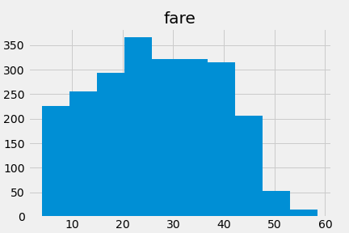
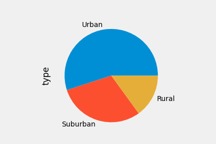
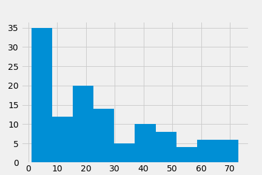
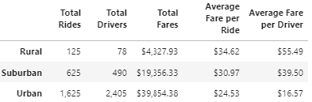
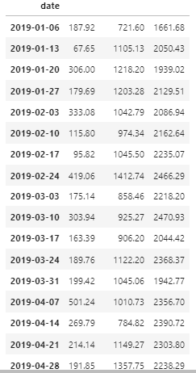

# PyBer_Analysis
## Ride share company analysis
## PyBer_Analysis
### Overview
This analysis is for a rideshare company named PyBer. The project source uses rides across urban, rural, and suburban cities. A dataframe summarizes the total rides, drivers, and fares and the related averages. The purpose of this analysis is to provide insight to decision-makers at PyBer.

### Resources
Data Source: city_data.csv, ride_data.csv
Software: Python 3.7.6, Visual Studio Code, 1.60

### Results
#### Deliverable 1: Get a Summary DataFrame 

 The urban cities had the most rides (1,625) and drivers (2,405), but fare amount between passengers ($24.53) and drivers ($16.57) is lower than other city types. Rural cities had the least rides (125) and drivers (78), but passengers payed more ($34.62) while drivers recieved more ($55.49) on average. Based on the Total Fares columnm, urban cities accumlated the most fares.
 
 

 

#### Deliverable 2.  Create a multiple line plot that shows the total weekly of the fares for each type of city.
Created a breakdown by week using .pivot and .resample.

 

Created an graph showing fare by month by type

### Summary
The three main business recommendations for PyBer would be increasing rides, increasing drivers, and increasing prices. Based on urban city data, more rides = more fares. Rural cities have a lower total amount of rides and drivers. Lowering fare costs can increase the number of rides in these areas. Having more drivers in suburban and urban cities would enable more rides to be taken. In urban cities, low individual fares don't equate to low overall fares, so the cost of a ride could be increased during months like January where there are fewer rides. Based on the summary data frame, having more rides is the strongest indicator in the sum of fares.